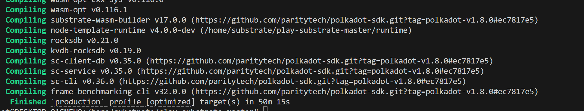
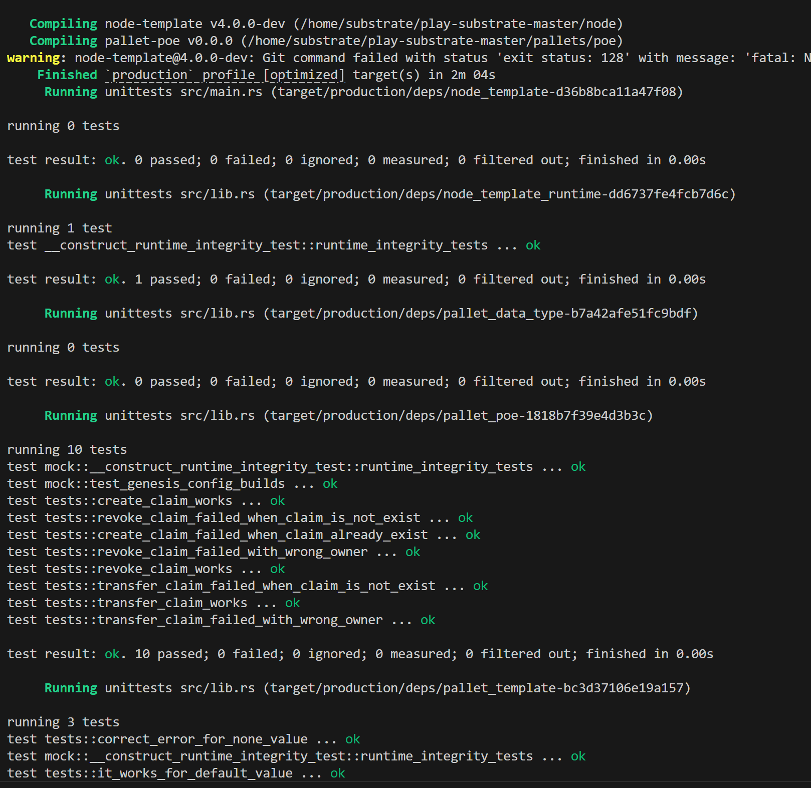

# building 
`cargo build --profile=production --features runtime-benchmarks`

# testing 
`cargo test --profile=production`


# bencchmark testing
```bash
./target/production/solochain-template-node benchmark pallet \
--chain dev \
--execution=wasm \
--wasm-execution=compiled \
--pallet pallet_poe \
--extrinsic "*" \
--steps 20 \
--repeat 10 \
--output pallets/poe/src/weights.rs \
--template .maintain/frame-weight-template.hbs
```

